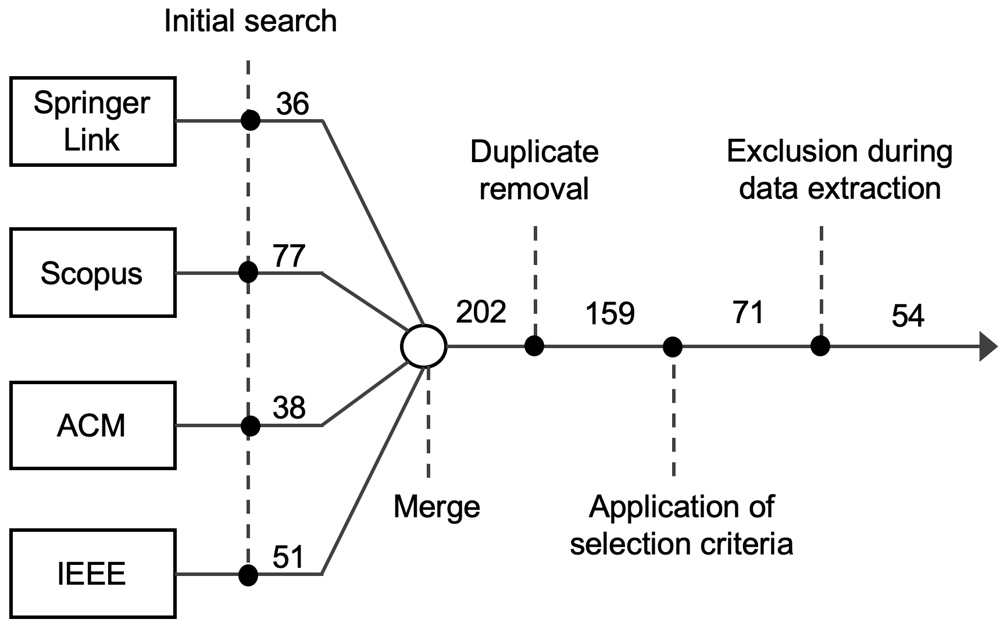

# Architectural Support to Performance-targeted Continuous Software Engineering: a Mapping Study

-  [Primary studies](./primary_studies.md)

## Selection process

After performing the automated search on digital libraries, we merged the obtained results and then removed duplicates, obtaining 159 papers. After that, we selected papers with respect to the selection criteria. In particular, for screening the publications, we defined the following exclusion criteria:

- is a book chapter
- is a secondary or tertiary study (survery, SLR, SMS, ...)
- not about continuous engineering/devops practices
- not about software performance
- not about software architecture
- not in the software engineering area
- not in English

After the application of those criteria, we obtained 71 papers.

